<picture>
  <source media="(prefers-color-scheme: dark)" srcset="./assets/profile-hero-dark.svg" />
  <source media="(prefers-color-scheme: light)" srcset="./assets/profile-hero-light.svg" />
  
</picture>

  Building observable, verifiable AI systems — from agent runtimes to scientific workflows.
   
  专注 Agent 工程、开发者工具，以及可观测、可验证的 AI 工作流。

  <a href="#selected-work">Selected Work</a>
  ·
  <a href="#open-source">Open Source</a>
  ·
  <a href="#professional-stack">Stack</a>
  ·
  <a href="mailto:lu740528977@gmail.com">Email</a>

## What I'm building

<table>
  <tr>
    <td width="33%" valign="top">
      <strong>01 · ORCHESTRATE</strong> 
      Reliable agent systems with explicit lifecycle, routing, and human-control boundaries.
    </td>
    <td width="33%" valign="top">
      <strong>02 · OBSERVE</strong> 
      Safe MCP tooling that turns runtime signals into compact, privacy-aware context.
    </td>
    <td width="33%" valign="top">
      <strong>03 · VERIFY</strong> 
      Evidence-backed automation and reproducible AI workflows that fail clearly.
    </td>
  </tr>
</table>

> 写得越少，bug 越少。自动化也应该可观察、可验证、可停止。

## Selected work

<table>
  <tr>
    <td width="50%" valign="top">
      <h3><a href="https://github.com/parkavenue9639/OmniCell-Agent">OmniCell-Agent</a></h3>
      
An observable research agent for reproducible single-cell RNA-seq analysis.

      <code>LangGraph</code> <code>FastAPI</code> <code>React</code>
    </td>
    <td width="50%" valign="top">
      <h3><a href="https://github.com/parkavenue9639/loop-engineering">loop-engineering</a></h3>
      
Maker-checker goal loops for bounded, evidence-backed coding-agent work.

      <code>Agent Skills</code> <code>Verification</code>
    </td>
  </tr>
  <tr>
    <td width="50%" valign="top">
      <h3><a href="https://github.com/parkavenue9639/external-agent-mcp">external-agent-mcp</a></h3>
      
A local MCP runtime for asynchronous delegation to external CLI coding agents.

      <code>MCP</code> <code>Node.js</code> <code>CLI Agents</code>
    </td>
    <td width="50%" valign="top">
      <h3><a href="https://github.com/parkavenue9639/jaeger-mcp">jaeger-mcp</a></h3>
      
A read-only, privacy-aware MCP server for querying and summarizing Jaeger traces.

      <code>Python</code> <code>MCP</code> <code>Observability</code>
    </td>
  </tr>
  <tr>
    <td width="50%" valign="top">
      <h3><a href="https://github.com/parkavenue9639/BaseGraph">BaseGraph</a></h3>
      
A full-stack FastAPI + LangGraph starter with React, SSE, and persistent checkpoints.

      <code>FastAPI</code> <code>LangGraph</code> <code>SSE</code>
    </td>
    <td width="50%" valign="top">
      <h3><a href="https://github.com/parkavenue9639?tab=repositories">More experiments →</a></h3>
      
RAG, MLX, biomedical NLP, scientific AI, and developer-tooling explorations.

      <code>Learn</code> <code>Build</code> <code>Iterate</code>
    </td>
  </tr>
</table>

## Open source

<table>
  <tr>
    <td width="50%" valign="top">
      <h3><a href="https://github.com/stablyai/orca">stablyai/orca</a></h3>
      
An agent development environment for working with fleets of parallel coding agents.

      <code>TypeScript</code> <code>Electron</code> <code>MIT</code>
    </td>
    <td width="50%" valign="top">
      <h3><a href="https://github.com/agentscope-ai/PawBench">agentscope-ai/PawBench</a></h3>
      
A benchmark for evaluating LLM × harness performance.

      <code>Python</code> <code>Agent Evaluation</code> <code>Apache-2.0</code>
    </td>
  </tr>
</table>

## Professional stack

  <picture>
    <source media="(prefers-color-scheme: dark)" srcset="https://skillicons.dev/icons?i=py%2Cts%2Cc%2Chtml%2Ccss%2Cpytorch%2Cdjango%2Cfastapi%2Creact%2Cpostgres%2Cdocker%2Clinux%2Capple%2Cgit%2Cbash&amp;perline=8&amp;theme=dark" />
    <source media="(prefers-color-scheme: light)" srcset="https://skillicons.dev/icons?i=py%2Cts%2Cc%2Chtml%2Ccss%2Cpytorch%2Cdjango%2Cfastapi%2Creact%2Cpostgres%2Cdocker%2Clinux%2Capple%2Cgit%2Cbash&amp;perline=8&amp;theme=light" />
    
  </picture>

- **AI & agents:** `LangGraph` · `LangSmith` · `PyTorch` · `NumPy` · `MLX` · `MCP`
- **Backend & product:** `FastAPI` · `Django` · `React` · `PostgreSQL`
- **Languages & web:** `Python` · `TypeScript` · `C` · `Shell` · `HTML5` · `CSS3`
- **Systems & workflow:** `Linux` · `macOS` · `Docker` · `Git` · `SONiC` · `Cursor`

## Activity

<picture>
  <source media="(prefers-color-scheme: dark)" srcset="https://raw.githubusercontent.com/parkavenue9639/parkavenue9639/output/github-contribution-grid-snake-dark.svg" />
  <source media="(prefers-color-scheme: light)" srcset="https://raw.githubusercontent.com/parkavenue9639/parkavenue9639/output/github-contribution-grid-snake.svg" />
  
</picture>

## Let's connect

If you're working on agent reliability, MCP tooling, or applied AI, feel free to [get in touch](mailto:lu740528977@gmail.com).
